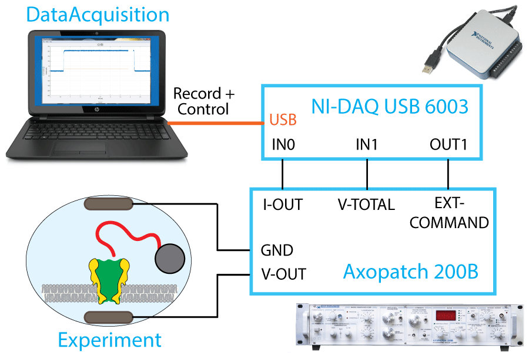
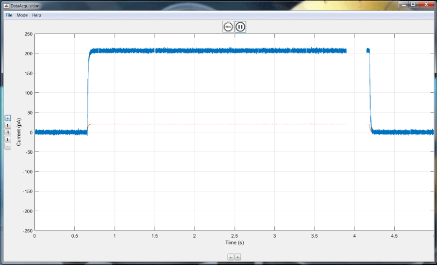
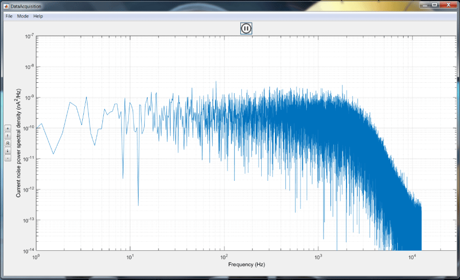
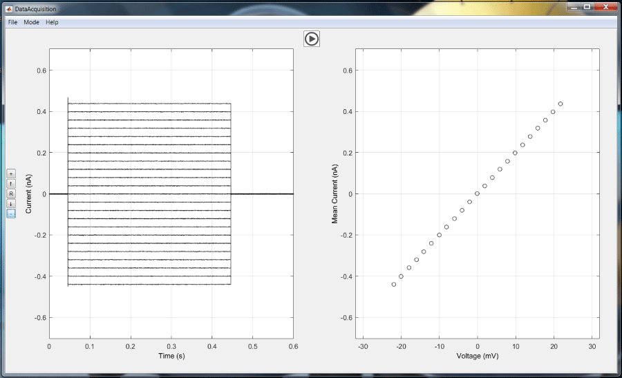
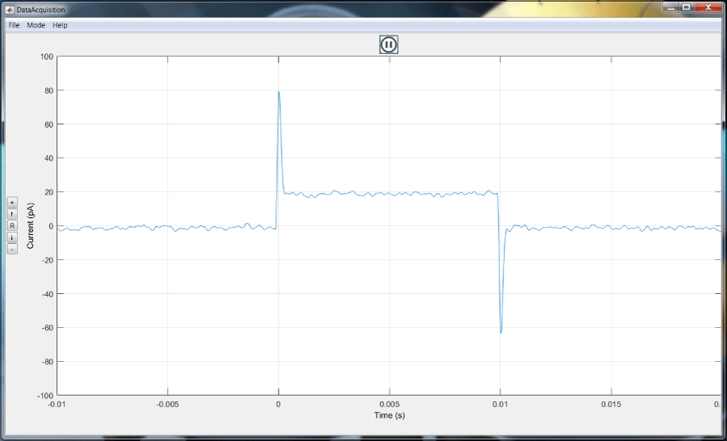
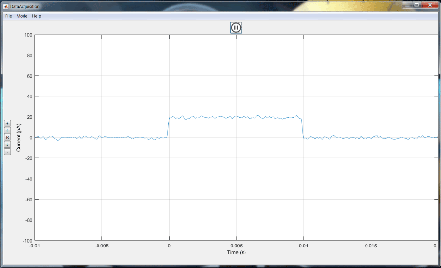

DataAcquisition
=======

## What

DataAcquisition is an open-source graphical user interface for viewing and recording data from a National Instruments DAQ in real time.  The program runs in MATLAB.  Specifically developed for patch-clamp electrophysiology recordings, DataAcquisition together with the [NI DAQ USB-6003](http://www.ni.com/en-us/support/model.usb-6003.html) provides an alternative to [Axon's pCLAMP software](https://www.moleculardevices.com/systems/axon-conventional-patch-clamp/pclamp-11-software-suite) together with the [DigiData](https://www.moleculardevices.com/systems/conventional-patch-clamp/digidata-1550-digitizer) analog-to-digital converter.




## Why

Other software platforms for recording data from a DAQ are usually either expensive or complicated.  This is a minimalist approach with a simple interface for viewing and saving data.  There are a few features tailored to electrophysiology recordings, such as noise plots, current-versus-voltage curves, and capacitive current measurements.  This program was developed for and field tested by Harvard's Fall 2016 Freshman Seminar lab course on nanopore DNA sequencing.


## Usage

```matlab
>> DataAcquisition;
```
or
```
>> d = DataAcquisition();
```

Optionally, you can input Channels, Alphas, OutputAlpha, and/or SampleFrequency as a list of name, value pairs:

```'Channels'``` should be paired with a vector (maximum of four elements) containing the integers 0 through 3 that specifies which channels are inputs. 
	e.g. [0, 1]
	Note: specify the scalings for all inputs and outputs if you specify any.

```'Alphas'``` should be paired with a vector of scale factors to apply to analog inputs (to convert measured values to either pA or mV).
	Note: you must specify the scale factors for all inputs if you specify any.
  
```'OutputAlpha'``` should be paired with a numeric scale factor to be applied to the analog output (to convert values in mV to voltage output in the range [-10,10] Volts).

```'SampleFrequency'``` should be paired with a numeric value that specifies the frequency at which data are sampled.  Default is 25kHz.
  Note: due to hardware limitations, the upper limit for the NI DAQ USB-6003 is 100kHz divided by the number of input channels.

### Note on file format

DataAcquisition by default saves data in the Dataacquisition Binary Format, a DBF file.  This can be opened and used for analysis in Matlab using Tamas Szalay's PoreView package with DBF file handling, found [here](https://github.com/sjfleming/PoreView-25o).

DBF files can be converted to other file formats for use in other data analysis pipelines.  In the DataAcquisition graphical interface, navigate to File > Convert Data File.  After selecting a DBF file for conversion, select either CSV or HDF for the desired output file format.  HDF files are better, and the same size as DBF files.  CSV files are easy to open in Excel or Notepad, but the file size is much much larger.

## Example Usage

You should have your DAQ plugged into the computer and the relevant National Instruments software installed.  The name of the device should be 'Dev1', which is the default.

To launch DataAcquisition, open MATLAB, navigate to the folder containing DataAcquisition.m, and type the following in the MATLAB command line:

```matlab
>> d = DataAcquisition();
```

The command above uses default values.  Or you can specify everything:

```matlab
>> d = DataAcquisition('Channels',[0,1],'Alphas',[100,100],'OutputAlpha',10,'SampleFrequency',25000);
```

Note that these parameters can also be changed using the graphical interface, once it has launched (File > Configure DAQ).

### Normal acquisition mode

View and record current and voltage as a function of time.



### Noise mode

View a plot of the noise power spectral density, updated in real time.



### IV curve mode

Record current at various voltages by applying a set of voltages for specified times.
On the left, current versus time is plotted at each voltage.
On the right, current is plotted as a function of voltage.  The linear relationship is characteristic of a resistor.



### Capacitance compensation mode

Display the current-versus-time response to a square-wave of 5mV, in order to look at the capacitive current spikes.  Capacitive current spikes can be compensated for on most current amplifiers used for electrophysiology by means of a "capacitance compensation" knob.  Using capacitance compensation mode makes this process easy by immediately showing the results of attempts at compensation.

Before compensation (capacitive current spikes visible):



After compensation (capacitive current spikes gone):




## Details of Setup

The ideal experimental setup is to have BNC cables attached to the current amplifier, and then to have BNC splitters attached to those cables, which splits the BNC into signal and ground.  These wires can be plugged into the DAQ separately (e.g. 0+ for current signal, and 0- for current ground), implementing differential sensing mode.  Connect the output of the current amplifier to DAQ channel 0, connect the membrane voltage output of the amplifier to DAQ channel 1, and connect the external command input on the current amplifier to DAQ AO0 (signal) and AO_ground (ground).

## Who

Stephen Fleming, PhD candidate at the Golovchenko Lab in the physics department at Harvard University, 2016.
